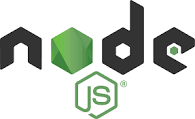

# CodeBrown

# Round Table Pizza Delivery Tracker

**Synopsis:**

Round Table Pizza Delivery Tracker is a mobile application designed to assist Round Table Pizza in managing deliveries efficiently. The application provides real-time tracking of delivery drivers' locations, allowing business managers to customize routes, enhance accountability, and respond promptly to emergencies.

# Project Description

**Client's Business:**

The client, Harmanjot Singh, owns multiple locations of Round Table Pizza in the Sacramento area.

**Value Expected:**

The project aims to benefit the business managers working for the client by providing a tool to manage deliveries efficiently. The application enhances accountability among delivery drivers, ultimately benefiting the client's business.

**Features:**

- Real-time location tracking of delivery drivers

  - The software tracks the live location of smartphones (delivery drivers' devices).

- Location sharing among users

  - Users can share their live location with others, facilitating communication and coordination.

- Logging and storing of visited locations at intervals

  - The application logs and stores previously visited locations at given intervals, providing a historical record.

- Two-factor authentication for user information security

  - To ensure user information security, the application implements two-factor authentication.

**Expected Uses:**

- Delivery Management

  - Review and manage driver locations during deliveries.

- Route Customization
  
  -Use real-time location data to customize and alter routes for more efficient deliveries.

- Emergency Assistance

  - Locate and assist drivers in case of vehicle breakdowns or emergencies.

**Expected Users:** 

Client: Harmanjot Singh 

Managers: Employed managers overseeing Round Table Pizza locations.

Delivery Drivers: Employed drivers responsible for pizza deliveries.

# Project Code

The provided codebase is a React Native application using Expo for development. It integrates with Firebase for authentication, real-time data storage, and location tracking.

**Backend:**

Firebase: A comprehensive mobile and web app development platform.

Authentication: Firebase Authentication for user authentication.

Firestore: Firebase's NoSQL database for real-time data storage.

**Frontend:**

React Native: A JavaScript framework for building mobile applications.

**Development Tools:**

Node.js: A JavaScript runtime for executing JavaScript code server-side.

**Integrated Development Environment (IDE):**

Visual Studio Code: A lightweight yet powerful code editor.

Android Studio: The official integrated development environment for Android app development.

**Version Control:**

Git: A distributed version control system.

**Testing:**

Android Studio: Comprehensive environment tailored for Android app creation.

**Development Instructions:**

Clone the repository.

**Git Clone:** https://github.com/your-username/round-table-pizza-tracker.git

Install dependencies using '**npm install**'.

Create a Firebase project and obtain configuration details.

Set up Firebase configuration in '**firebaseConfig.js**'.

Update the firebaseConfig.js file with your Firebase configuration.

Run the application using '**npm start**'.

**Testing:** 

The project includes a testing suite. Run tests with '**npm test**'.

**Deployment:**

Deploy the application on an emulator or physical device using '**npm start**'.

**Prerequisites:**

Node.js

npm

## Timeline Milestones:

**CSC 190 Fall 2023:**

**Done**: Project setup and Firebase integration.

**Done:** Implement basic authentication and user interface.

**CSC 191 Spring 2024:**

Week 1-2: Develop real-time location tracking and sharing features.

Week 3-4: Implement location logging and two-factor authentication.

Week 4-5: Conduct testing and resolve any issues.

Week 6-7: Improve button responsiveness and feedback on user interaction.

Week 7-9: Ensure a consistent layout across different screen sizes.

Week 9-10: Finalize documentation and prepare for deployment.

## Entity Relationship Diagram (ERD)

## Prototype Images

**Contact Information:**

Client: Harmanjot Singh

Phone Number: (916)-613-3539

Email Address: hsghuman02@gmail.com

## Authors

- [@Harteshwar](https://github.com/Harteshwar)
- [@kidKorste](https://github.com/kidKorste)
- [@covnictzz](https://github.com/covnictzz)
- [@alexfakai](https://github.com/alexfakai)
- [@akashdeep42](https://github.com/akashdeep42)
- [@saulb99](https://github.com/saulb99)
- [@ikjxt](https://github.com/ikjxt)

This project is part of the Senior Project by Team Code Brown.
